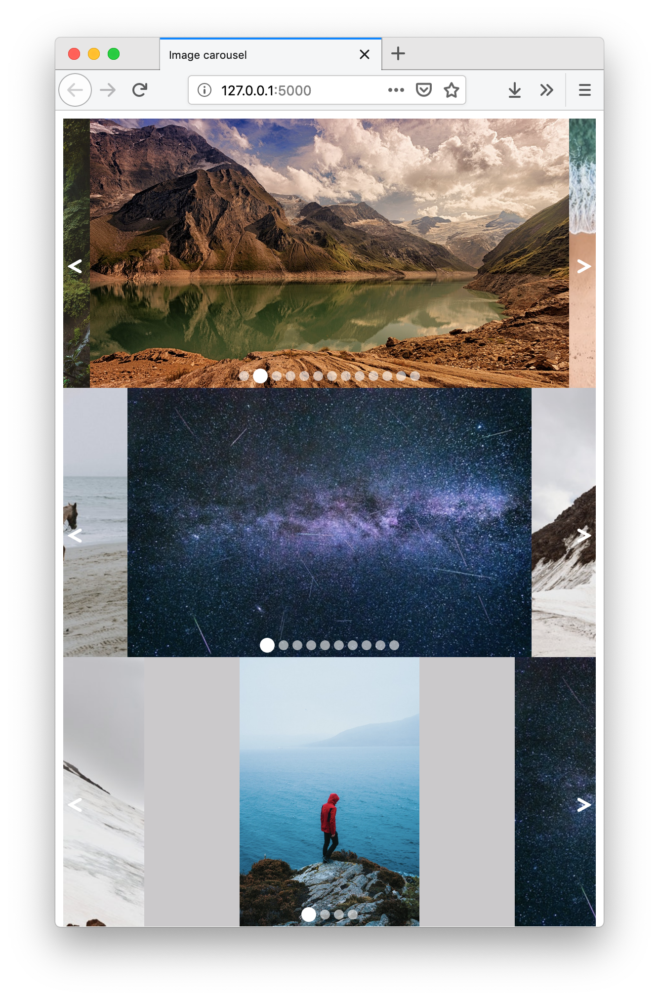
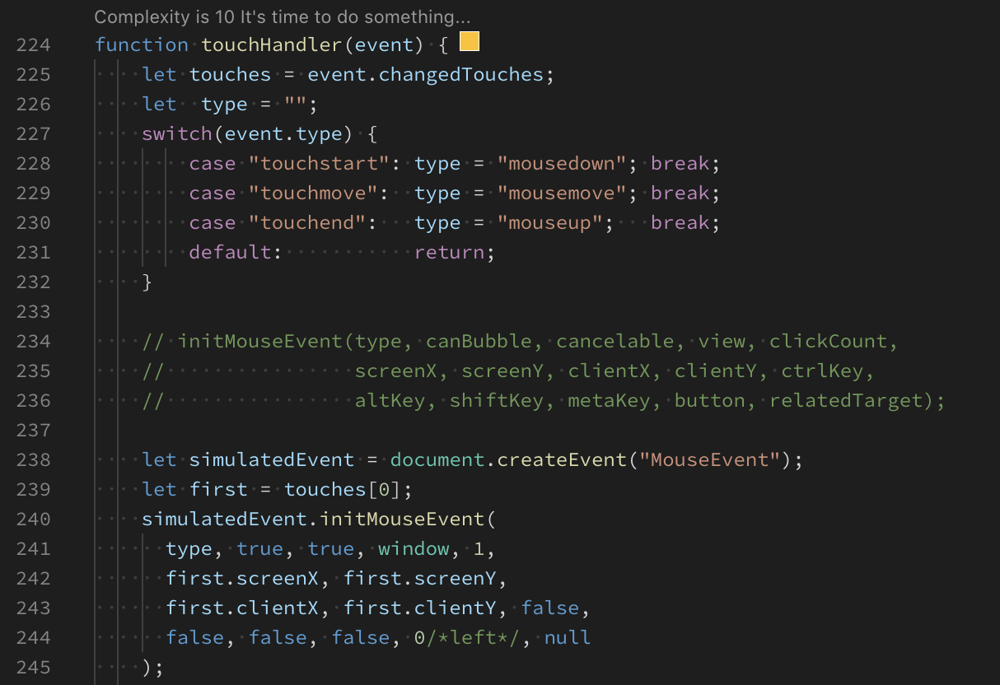

# Image gallery (celtra test task)

```md
Create a gallery that fetches images from a remote API and displays them in a swipeable
container. Make sure to optimise code for mobile performance.
Instructions
- When creating a new gallery instance, pass in options object.
- Multiple galleries can be used on the same page.
- Gallery should pull images from an API that returns a list of images (API url provided
below).
- Preload all visible and partially visible images. Other images should be loaded
afterwards.
- Gallery should be responsive and fill entire container size. Make sure to adapt if
container is resized after initial load.
- Images should be resized to match gallery height. When resizing images keep their
aspect ratio. Depending on container and image aspect ratio multiple panels can be
visible at the same time.
- Panels should be swipeable by touch or mouse and snap in place when appropriate
threshold is met (define it yourself).
- Selected image should be horizontally centered in the gallery.
- While developing make sure to expose an API for common functions (nextItem,
previousItem, goToItem).
- Gallery should display pagination icons with active state (check images below).
- You can use HTML, CSS and Javascript for frontend and your preferred language for the
backend.
- Using of 3rd party libraries, toolkits, frameworks etc. is not allowed.
- Please send us the code in a zip container or a link to a private repo with instructions
on how to set testing environment.
Options
- Reference to a container DOM element.
- API url.
- Enable / disable of panel looping.
- Specify the item to be displayed when the component loads.
API specification
- URL: https://campaigns.celtra.com/developer-tasks/swipey-gallery/
- Response: JSON array.
- API will return a random number of images (min 2) each call.
```

## How to

```zsh
# create virtual enviroment
virtualenv --python=/usr/local/bin/python3 venv

# activate virtual enviroment
source venv/bin/activate

# install requirements
pip install -r requirements.txt

# run the server
python3 app.py
```

## Demo



> Javascript complexity not more than 10

